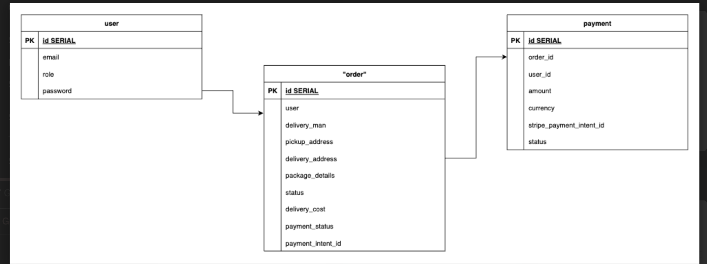

#  Courier Management System — Backend API

A scalable RESTful backend API for managing a courier service, built using Django REST Framework. The system supports multiple roles (Admin, User, Delivery Man), secure JWT authentication, order creation & tracking, and Stripe payment integration.

---

##  Features

##  Authentication (JWT)
- Register with email, password, and role (`user`, `admin`, `delivery_man`)
- Secure login with JWT token issuance
- Update user profile

##  Role-based Access
- **Admin**
  - View all orders
  - Assign delivery men to orders
- **Delivery Man**
  - View only assigned orders
  - Update order status (`pending`, `delivered`, `complete`)
- **User**
  - Create new orders
  - View and track their own orders

##  Order Management
- Create orders with pickup & delivery details
- Order status tracking
- Admin assignment of delivery men

##  Stripe Integration
- Handle card-based payments securely
- Accept card number, expiry, CVC

---

## ️ Tech Stack

- **Backend**: Django, Django REST Framework
- **Authentication**: JWT (`djangorestframework-simplejwt`)
- **Database**: SQLite3 (for development)
- **Docs**: Swagger + ReDoc via `drf-yasg`
- **Payments**: Stripe API
- **Version Control**: Git + GitHub Actions

---

##  Getting Started

##  Prerequisites

- Python 3.12
- pip
- Stripe Test Account (get your API key)

##  Installation

```bash
git clone https://github.com/yourusername/courier-management-system.git
cd courier-management-system

python -m venv .venv
source .venv/bin/activate  # For Linux/macOS
# .venv\Scripts\activate    # For Windows

pip install -r requirements.txt
```


## Environment Setup
```bash
STRIPE_SECRET_KEY=sk_test_yourkey
```

## Run Locally 
```bash
python manage.py migrate
python manage.py createsuperuser
python manage.py runserver
```

## ERD Diagram


## API Endpoint
### Auth Endpoint
| HTTP  | Endpoint            | Action                                  |
| ----- |---------------------| --------------------------------------- |
| POST  | `/api/v1/register/` | Register a new user                     |
| POST  | `/api/v2/login/`    | Authenticate user and return JWT tokens |
| GET   | `/api/v1/profile/`  | Retrieve current user profile           |
| PATCH | `/api/v1/profile/`  | Update current user profile             |


### Orders Endpoint
| HTTP   | Endpoint       | Action                                                               |
| ------ | -------------- | -------------------------------------------------------------------- |
| POST   | `/api/v1/orders/`    | Create a new order (User only)                                       |
| GET    | `/api/v1/orders/`    | Retrieve orders (role-based: admin/all, user/own, delivery/assigned) |
| GET    | `/api/v1/orders/:id/` | Retrieve a specific order                                            |
| PUT    | `/api/v1/orders/:id/` | Admin: assign delivery man / Delivery: update status                 |
| PATCH  | `/api/v1/orders/:id/` | Admin: assign delivery man / Delivery: update status                 |
| DELETE | `/api/v1/orders/:id/` | Delete an order (admin only, if implemented)                         |

### Deliver Management
| HTTP  | Endpoint       | Action                                   |
| ----- |----------------| ---------------------------------------- |
| GET   | `/api/v1/orders/`     | Delivery man: view assigned orders       |
| PATCH | `/api/v1/orders/:id/` | Delivery man: update status of the order |

## Payment
| HTTP | Endpoint    | Action                     |
|------|-------------|----------------------------|
| POST | `/api/v1/payment/`  | Make a payment via Stripe  |
| GET  | `/api/v1/payments/` | Get the user's all payment |


## API Docs
- Swagger UI: /api/
- ReDoc: /redoc/

## GitHub Actions (CI)
- GitHub workflow runs:
  - On push to main or PR
  - Installs dependencies
  - Runs Django migrations


## Security
- Sensitive data (Stripe keys) are stored in .env and not committed
- Role-based access control enforced per endpoint
- GitHub push protection for secret scanning enabled


## Folder Structure
```bash
├── core/
│   └── settings.py
├── accounts/
│   ├── models.py       
│   ├── serializers.py
│   └── views.py
├── order/
│   ├── models.
│   ├── serializers.py
│   └── views.py
├── payment/
│   ├── models.
│   ├── serializers.py
│   └── views.py
├── .env
├── requirements.txt
└── manage.py
```

## Author
**Symon Barua**
- Github: [@sin1ter](https://github.com/sin1ter)
